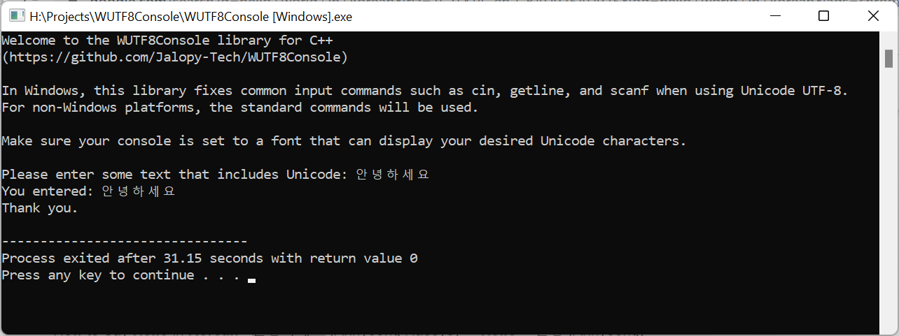

# WUTF8Console C++ Library

**A C++ library to have a Windows UTF-8 console for Unicode input and output.**

## Table of Contents
[Overview](#overview)<br>
[Requirements](#requirements)<br>
[Examples](#examples)<br>
[Instructions](#instructions)<br>
[Background](#Background)<br>
[Using Namespaces](#using-namespaces)<br>
[Passing in Unicode UTF-8 arguments to *main()*](#Passing-in-Unicode-UTF-8-arguments-to-main())<br>
[Input Buffer Size](#Input-Buffer-Size)<br>
[Single Characters and Unicode](#Single-Characters-and-Unicode)<br>
[Windows Console Font](#Windows-Console-Font)<br>
[Command Reference](#Command-Reference)<br>
[License](#License)<br>
[Contact](#Contact)<br>
[Thanks](#Thanks)<br>

## Overview

The Window's console (called *Windows Terminal* or *Command Prompt*) has the problem that it cannot input in Unicode (UTF-8) using standard C++ input commands such as `cin >>`, `getline()`, and `scanf()`, even though it can output in Unicode (UTF-8). Platforms such as Linux and macOS don't have this problem. The [WUTF8Console C++ library](https://github.com/Jalopy-Tech/WUTF8Console/releases) solves this problem.

This library allows a C++ console program to use all common C++ input commands to input with Unicode (UTF-8) in Windows. It works by replacing the standard commands with ones that handle UTF-16 input needed by Windows and automatically translating the input to UTF-8 for data types such as `std::string` and `char*`. The replacement commands include `cin >>` (operators and other methods), `getline()`,  and `scanf()`. Output commands from namespace *std* such as `cout <<` , `cerr <<` and `printf()` also work normally.

Because this library allows both input and output in Unicode (UTF-8), modern IDEs such as [Embarcadero Dev-C++ 6.3](https://github.com/Embarcadero/Dev-Cpp),  [Code::Blocks](https://www.codeblocks.org/) and [Visual Studio Code](https://code.visualstudio.com/) can be used instead old IDEs such as [Dev-C++ 5.2](https://sourceforge.net/projects/orwelldevcpp/). The IDE and console application won't be tied to a Windows locale coding page.

The library has been designed to be cross-platform compatible, so that the same source code will compile on non-Windows platforms where the application will use the standard commands only.

## Requirements

The WUTF8Console C++ library has the following requirements:

- C++ version of C++14 or higher. It compiles with ISO C++14, ISO C++17 and ISO C++20. It won't compile with C++11. On non-Windows platforms, it can use any C++ version.
- Compilers [GCC](https://gcc.gnu.org/), [MSVC](https://visualstudio.microsoft.com/vs/features/cplusplus/) and [LLVM Clang](https://clang.llvm.org/) work.
- Windows versions Windows 10 and Windows 11 work.
- The Windows console needs to be set to a font that can display the desired Unicode characters to see it working. See the section [Windows Console Font](#Windows-Console-Font).

## Examples

Here is an example of main.cpp for Windows-only compilation:

```cpp
// WUTF8Console C++ library - main() demonstration for Windows
// https://github.com/Jalopy-Tech/WUTF8Console

#include <iostream>
#include <stdio.h>

// Include the WUTF8Console C++ library

#include "wutf8console.h"

// Please don't use "using namespace std;" as this will create
// an ambiguous compiler error.

using wutf8console::cin;
using wutf8console::getline;
using wutf8console::scanf;
using std::cout;
using std::endl;

using std::string;

// If Unicode UTF-8 is needed in the arguments in main()'s argv,
// link the libwinsane.o file when compiling in Windows.

int main(int argc, char** argv) {

	// Set the console to UTF-8 in Windows.
    
	wutf8console::setupConsole();

    
	// Print welcome message using printf().
    
	char website[] = "https://github.com/Jalopy-Tech/WUTF8Console";
	printf("Welcome to the WUTF8Console library for C++ \n%s\n\n", website);

    
	// Print info using cout <<
    
	cout << "In Windows, this library fixes common input commands such as " << endl;
	cout << "cin, getline, and scanf when using Unicode UTF-8." << endl << endl;
	cout << "Make sure the Windows console is set to a font that can " << endl;
	cout << "display your desired Unicode characters." << endl <<endl;

	// Prompt for string using cout << and get input using getline() with cin
    
	cout << "Please enter some text that includes Unicode: ";
	string s;
	getline(cin, s);
	cout << endl << "You entered: " << s << endl;
	cout << endl << "Thank you." << endl;

	return 0;
}
```

Here is an example of main.cpp for cross-platform compilation:

```cpp
// WUTF8Console C++ library main() demonstration for cross-platform
// https://github.com/Jalopy-Tech/WUTF8Console

#include <iostream>
#include <stdio.h>

// Include the WUTF8Console C++ library

#include "wutf8console.h"

// Please don't use "using namespace std;" as this will create
// an ambiguous compiler error.

// Use two alternative sets of input commands

#ifdef _WIN32 // Windows platform (including 64 bit)
using wutf8console::cin;
using wutf8console::getline;
using wutf8console::scanf;
#else // Non-windows platforms
using std::cin;
using std::getline;
using std::scanf;
#endif


// Use one set of output commands

using std::cout;
using std::endl;


// Use other commands

using std::string;

// If Unicode UTF-8 is needed in the arguments in main()'s argv,
// link the libwinsane.o file when compiling in Windows.

int main(int argc, char** argv) {

	// Set the console to UTF-8 in Windows.
    
	wutf8console::setupConsole();


	// Print welcome message using printf().
    
	char website[] = "https://github.com/Jalopy-Tech/WUTF8Console";
	printf("Welcome to the WUTF8Console library for C++ \n%s\n\n", website);

	// Print info using cout <<
	cout << "In Windows, this library fixes common input commands such as ";
	cout << "cin, getline, and scanf when using Unicode UTF-8." << endl << endl;
	cout << "In non-Windows platforms, the standard commands will be used." << endl;
	cout << endl <<  "Make sure the Windows console is set to a font";
	cout << " that can display your desired Unicode characters." << endl <<endl;

    
	// Prompt for string using cout << and get input using getline() with cin
    
	cout << "Please enter some text that includes Unicode: ";
	string s;
	getline(cin, s);
	cout << endl << "You entered: " << s << endl;
	cout << endl << "Thank you." << endl;

	return 0;
}
```

Here is a screenshot of the Windows console using the WUFT8Console C++ library:



## Instructions

To use the WUTF8Console C++ library  with your console application, do the following:

1. Download the [latest release](https://github.com/Jalopy-Tech/WUTF8Console/releases) and add the *wutf8console.cpp* and *wutf8console.h* files to your source code.

2. Include this header:

   ```cpp
   #include "wuft8console.h"
   ```

3. Use `using wutf8console::[member-name];`declarations for input commands and use `using std::[member-name];` declarations for output commands. Don't use the `using namespace std;` directive as this will create an ambiguous compiler error (and is considered bad practice anyway).

   Use a set of input commands and a set of output commands.  Example code to use `cin`, `getline()`, `scanf()`, `cout` and `endl`:

   ```cpp
   // Use input commands
   
   using wutf8console::cin;
   using wutf8console::getline;
   using wutf8console::scanf;
   
   
   // Use output commands
   
   using std::cout;
   using std::endl;
   ```

   OR

   For cross-platform compatibility, use two alternative sets of input commands (one for Windows and one for non-Windows) and one set of output commands.  Example code to use `cin`, `getline()`, `scanf()`, `cout` and `endl`:

   ```cpp
   // Use two alternative sets of input commands
   
   #ifdef _WIN32 // Windows platforms (including 64-bit)
   using wutf8console::cin;
   using wutf8console::getline;
   using wutf8console::scanf;
   #else // Non-windows platforms
   using std::cin;
   using std::getline;
   using std::scanf;
   #endif
   
   
   // Use output commands
   
   using std::cout;
   using std::endl;
   ```

   For alternative namespace options, see the section [Using Namespaces](#Using-Namespaces).

4. Before doing any input from or output to the console, add this line:

   ```cpp
   wutf8console::setupConsole();
   ```

   In Windows, this command will set the Windows console to use Unicode. This command does nothing when compiled on non-Windows platforms as these platforms already handle Unicode (UTF-8) input and output by default.

5. Use the commands you declared such as `cin >>`, `getline()`, `scanf()`, `cout <<` and `printf()` normally. When the data types `std::string` and `char*` are used with these commands , Unicode will be input from and output to the Windows console correctly. Don't use wide character data types such as `wchar_t*` and `wstring`: they are not needed and they are not welcome!

5. If Unicode (UTF-8) is needed in the arguments passed into `main()`s `argv`list, link the *libwinsane.o* file when compiling in Windows. See the section [Passing in Unicode UTF-8 arguments to *main()*](#Passing-in-Unicode-UTF-8-arguments-to-main()).

6. Make sure the Windows console is set to a font that can display your desired Unicode characters. See the section [Windows Console Font](#Windows-Console-Font).

## Background

This library has been written for students learning C++ coding in Windows where foreign-language input to the Windows console is needed.  Before now, non-ASCII characters could only be entered with these commands when using an obsolete non-Unicode compliant IDE such as [Dev-C++ 5.2](https://sourceforge.net/projects/orwelldevcpp/) with the Windows locale coding page set to the desired language.

 Modern IDEs such as [Embarcadero Dev-C++ 6.3](https://github.com/Embarcadero/Dev-Cpp),  [Code::Blocks](https://www.codeblocks.org/) and [Visual Studio Code](https://code.visualstudio.com/) could not be used. These IDEs can now be used when using this library. 

I hope this library is useful for:

- Programmers who wish to create a simple Windows console application with Unicode input and/or output.
- Schools, teachers and students in non-English speaking environments where students are learning C++ in Windows. Online C++ resources and examples invariably use standard commands for input and output.
- Developers who wish to build a professional UTF-8-compliant console application (including cross-platform applications). Although this library hasn't been designed for such tasks, I would love to hear from you in this regard.

Without this library, there are only three possibilities in Windows for Unicode input to the Windows console:

1. Use the Windows locale setting to use non-Unicode Windows coding pages. In fact this isn't even Unicode and it's a mess! This doesn't work when using modern IDEs.

   OR

2. Use the wide-character versions of the C++ commands such as wscanf() and wcin >>. Good luck with this! They are fraught with problems and are a pain to use.

   OR

3. Use the Microsoft Windows API to input Unicode with commands such as `ReadConsole()`. This is a hassle when wishing to write a simple console application in C++. It is also unreasonable to expect students to do this when they are learning C++ for the first time and barely know basic programming constructs such as for loops and if/else statements!

## Using Namespaces

The input commands need to use the version in namespace *wutf8console* when compiled in Windows. The output commands can use the version in namespace *std*.

### Using *using* declarations

You can use `using` declarations for both input and output. See the section [Instructions](#Instructions). for an example. Don't use the `using namespace std;` directive as this will create an ambiguous compiler error (and is considered bad practice anyway). 

For cross-platform compilation,  input commands need two sets: one for Windows and one for non-Windows. Example code to use  `cin`, `getline()`, `scanf()`, `cout` and `printf()`:

```cpp
// Use these input commands.

#ifdef _WIN32 // Windows platforms (including 64-bit)
using wutf8console::cin;
using wutf8console::getline;
using wutf8console::scanf;
#else // Non-windows platforms
using std::cin;
using std::getline;
using std::scanf;
#endif


// Use these output commands.

using std::cout;
using std::endl;


// Use other commands

using std::string;

//...

cout << "Welcome" << endl << "Enter your name: ";
string name;
cin >> name;
```

There are some commands such as `fgets()` and `gets()` that when used with a `using` declaration, might cause a "conflicts with a previous declaration" compile error. These commands have been depreciated since C++14, but if you need to use them, you can specify the namespace *wutf8console* explicitly for these commands as described in the next section.

### Specifying the namespace explicitly

You can specify the namespace explicitly for each command such as:

```cpp
std::cout << "Welcome" << std::endl << "Enter your name: ";
std::string name;
wutf8console::cin >> name;
```

To make this cross-platform compatible, use preprocessor directives to provide two alternatives for input:

```cpp
std::cout << "Welcome" << std::endl << "Enter your name: ";
std::string name;
#ifdef _WIN32 // Windows platforms (including 64-bit)
wutf8console::cin >> name;
#else // Non-windows platforms
std::cin >> name;
#endif
```

### Using the *using namespace* directive

Using the `using namespace` directive to include everything from the namespace is not considered good coding practice even though it features commonly in sample code such as the `using namespace std;` directive. If you wish to use this directive, make sure that there is no ambiguity between the namespace *wuft8console* and the namespace *std*.

Ambiguity can be avoided by using the `using namespace` directive in different scopes to avoid clashes.

Alternatively you could use the `using namespace std;` directive, but explicitly specify the namespace *wutf8console* in each input command. For example:

```cpp
using namespace std;

//...

cout << "Welcome" << endl << "Enter your name: ";
string name;
wutf8console::cin >> name;
```

To make this code cross-platform compatible, use preprocessor directives to provide two alternatives for input:

```cpp
using namespace std;

//...

cout << "Welcome" << endl << "Enter your name: ";
string name;
#ifdef _WIN32 // Windows platforms (including 64-bit)
wutf8console::cin >> name;
#else // Non-windows platforms
cin >> name;
#endif
```

## Passing in Unicode UTF-8 arguments to *main*()

When compiling in Windows, arguments won't be passed into`int main(int argc, char** argv)` as Unicode by default. A simple fix to this, if needed, is to use a library called [libwinsane](https://github.com/skeeto/scratch/tree/master/libwinsane) which consists of a single object file *libwinsane.o* which can be linked with your project when compiling in Windows. No `#include` directive is needed in your source code.

You are welcome to download and try my pre-compiled [libwinsane.o](https://github.com/Jalopy-Tech/WUTF8Console/blob/main/libwinsane/libwinsane.o) file, but I recommend compiling it from source using the *make* command as follows:

1. Make sure your compiler (bin folder) is in your Windows PATH.

2. Download the 5 files in the [libwinsane repository](https://github.com/skeeto/scratch/tree/master/libwinsane) to a new local folder.

3. Edit the *Makefile* file: on line 2, change the line from:<br>
    `CROSS   = x86_64-w64-mingw32-`<br>
      to:<br>
    `CROSS   =`

4. Open the folder in a Windows console (Terminal).

5. Run the `make` command. Your make command might not be `make`. For example, it might be `mingw32-make`.

Once compiled, do the following:

1. Copy the *libwinsane.o* file to your source code folder.
2. Set you compiler to link this file. This can be done using an IDE feature or by manually adding an option to the linker such as `-L libwinsane.o` .

## Input Buffer Size

The commands `scanf()` and `gets()` need to have a input buffer size which is set to an array size of 4,096 characters. If a different buffer size is required, the `INPUT_BUFFER_SIZE` value can be adjusted at the start of *wutf8console.h*.

## Single Characters and Unicode

The `char` data type uses one byte, which can only store ASCII characters and therefore cannot be used to store single Unicode characters. I recommend storing a single Unicode character as a `std::string` of length 1 or an `int`. I don't recommend using `wchar_t` as this may cause cross-platform issues.

Commands like `scanf("%c", &c);` and `cin >> c;` won't help: they will accept any Unicode character as input, but will only store an ASCII character in the `char` variable c.

## Windows Console Font

When using the Windows console (called *Windows Terminal* or *Command Prompt*), the font that is set needs to be able to display the desired Unicode characters.

To view or change the font, do the following:

1. Open the console.
2. Click on the top left icon, then select Properties.
3. The font and font size can be viewed and changed.
4. Click Ok to save changes.

Fonts such as *NimSimSun*, *Lucinda Console* or *Consolas* may be suitabe. If there are no suitable fonts, a suitable font may be available online for download. Adding the relevant language to Windows may also add a suitable font. For some languages, special changes may need to be done to allow the Windows console to display the desired font.

A particular Windows locale (a coding page) is not needed as Unicode UTF-8 is used instead.

## Command Reference

The following commands are available in the *wutf8console* namespace:

### *wutf8console::* input functions

```cpp
std::istream& getline(std::istream& is, std::string& str); // [recommended]
std::istream& getline(std::istream& is, std::string& str,
                      const char delim); // [recommended]
int scanf(const char* format, ...);
int fscanf(FILE * stream, const char* format, ...);
char* fgets(char *str, int num, FILE *stream); // [depreciated!]
char* gets(char *str); // [depreciated!]
int getc(FILE *stream ); // [not recommended]
int fgetc(FILE *stream ); // [not recommended]
int getchar(); // [not recommended]
```

### *wutf8console::cin >>* input operators

```cpp
Cin& operator>>(std::string& s); // [recommended]
Cin& operator>>(char* cstr);
Cin& operator>>(char& c);  // [not recommended]
Cin& operator>>(T& t); // T is a generic typename // [recommended]
```

### *wutf8console::cin* istream public members

```cpp
std::streamsize gcount() const; // [not recommended]
int get(); // [not recommended]
Cin& get(char& c);  // [not recommended]
Cin& get(char* s, std::streamsize n); // [not recommended]
Cin& get(char* s, std::streamsize n, char delim); // [not recommended]
//Cin& get(std::streambuf& sb); // [not yet implemented]
//Cin& get(std::streambuf& sb, char delim); // [not yet implemented]
Cin& getline(char* s, std::streamsize n );
Cin& getline(char* s, std::streamsize n, char delim ); 
Cin& ignore(std::streamsize n, int delim);
int peek();
Cin& putback(char c);
Cin& read(char* s, std::streamsize n);
std::streamsize readsome(char* s, std::streamsize n);
Cin& seekg(std::streampos pos);
Cin& seekg(std::streamoff off, ios_base::seekdir way);
int sync();
std::streampos tellg();
Cin& unget();
```

### *wutf8console::cin* ios public members

```cpp
bool bad() const;
void clear(iostate state);
//std::istream& copyfmt(const std::istream& rhs); [not yet implemented]
bool eof() const;
std::istream::iostate exceptions() const;
void exceptions(std::istream::iostate except);
bool fail() const;
char fill() const;
char fill(char fillch);
bool good() const;
std::locale imbue(const std::locale& loc);
char narrow(char c, char dfault) const;
explicit operator bool() const;
bool operator!() const;
//std::streambuf* rdbuf() const; // [not yet implemented]
//std::streambuf* rdbuf (std::streambuf* sb); // [not yet implemented]
std::istream::iostate rdstate() const;
void setstate(std::istream::iostate state);
std::ostream* tie() const;
std::ostream* tie(std::ostream* tiestr);
char widen(char c) const;
```

### *wutf8console::* other functions

```cpp
bool setupConsole(); // [necessary]
```

## License

Copyright &copy; 2022 Robert J. Joynt.

The WUTF8Console C++ Library is free software under the [MIT License](https://github.com/Jalopy-Tech/WUTF8Console/blob/main/LICENSE.md).

## Contact

For further inquires, please email: robertjjoynt@gmail.com .

## Thanks

- To Eric the Viking, my student, for bringing this problem to my attention and testing the library.
- [Chris Wellons](https://nullprogram.com/blog/2021/12/30/) for writing the [libwinsane library](https://github.com/skeeto/scratch/tree/master/libwinsane) which allows Unicode UTF-8 arguments to be passed into  a Windows console C++ program.
- To [Jarod42](https://stackoverflow.com/users/2684539/jarod42) for providing the [code](https://stackoverflow.com/questions/39101454/pushing-and-popping-the-first-element-of-a-stdtuple) to pop off the first element of a tuple in Stack Overflow.
